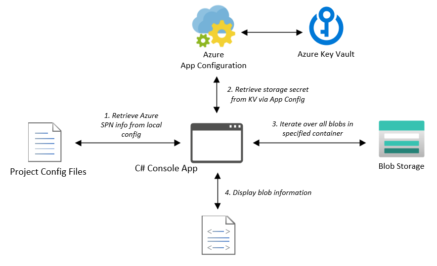

# Key Vault Demos - ASP.Net Web App

## Code in this repo demonstrates accessing Azure Key Vault from an ASP.Net web application 

<properties
    pageTitle="Key Vault ASP.Net Demo"
    description="Sample application demonstrating usage of Azure Key Vault from an ASP.Net web application"
    services="key-vault,app-configuration,blob-storage"
    documentationCenter="Azure"
/>

<tags
    ms.service="key-vault"
    ms.devlang="C#"/>

Assemblies utilized:
- Azure.Identity
- Azure.Security.KeyVault
- Azure.Storage
- System.Configuration

The application utilizes the Azure.Identity.SecretClient class in order to access an Azure Key Vault. A local instance of this class is instantiated utilizing:
- Key Vault URI
- Azure.Identity.ClientSecretCredential token

The ClientSecretCredential token is returned from a call to the Azure.Identity.ClientSecretCredential constructor utilizing:
- Azure Tenant ID
- Service Principal App ID
- Service Principal Secret

Once the SecretClient object is instantiated its GetSecret method is invoked to return an Azure.Security.KeyVault.KeyVaultSecret object containing a blob storage connection string. This connection string is then utilized to access the blob information returned by the application.
