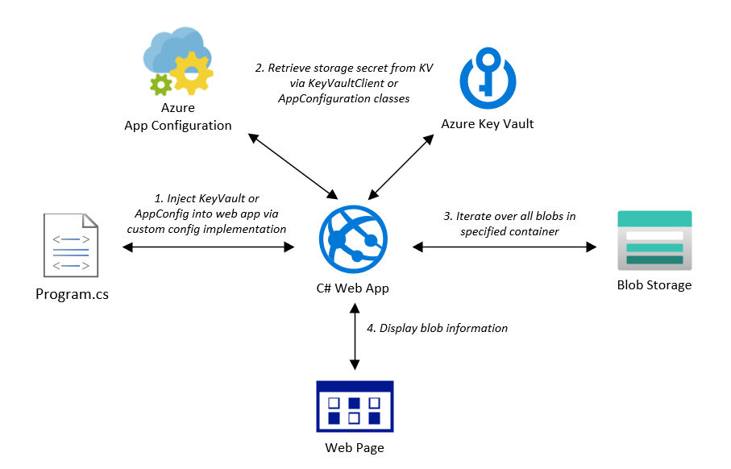

# Key Vault Demos - ASP.Net Web App

## Code in this repo demonstrates accessing Azure Key Vault from an ASP.Net web application 

<properties
    pageTitle="Key Vault ASP.Net Demo"
    description="Sample application demonstrating usage of Azure Key Vault from an ASP.Net web application"
    services="key-vault,app-configuration,blob-storage"
    documentationCenter="Azure"
/>

<tags
    ms.service="key-vault"
    ms.devlang="C#"/>

Assemblies utilized:
- Azure.Identity
- Azure.Security.KeyVault
- Azure.Storage
- Microsoft.Azure.Services.AppAuthentication
- Microsoft.Azure.KeyVault

The application provides examples for connecting to Azure Key Vault using either KeyVaultClient or AzureAppConfiguration. Either one of these classes can be injected into an ASP.Net Core configuration by implementing a custom IHostBuilder during startup. Both implementations are demonstrated.

KeyVaultClient once provided the URI endpoint of an Azure Key Vault instance will attempt to attain a connection token via:
- Managed Service Identity
- \<localuser>\AppData\Local\.IdentityService\AzureServiceAuth\tokenprovider.json
- Azure CLI

AzureAppConfiguration requires a connection string to the indicated Azure App Configuration instance. This could be provided via:
- Local User Secret
- Environment Variable
- Local Config File

Once the custom instance of IHostBuilder is implemented in startup, include it in any project controller instances with a constructor that implements the IConfiguration interface. Once implemented, the local configuration object can be used as an array to reference configuration settings by name (sample provided).

This sample app retrieves the connection string to a specified blob storage account in the Index method of the HomeController object. It then uses this to instantiate an Azure.Storage.Blobs.BlobServiceClient, which is then used to iterate an indicated container to populate an AspNetKeyVault.Models.BlobList object.

Both the IConfiguration and BlobList objects are injected into the Index.cshtml Blazor page which iterates these object's information for display.
