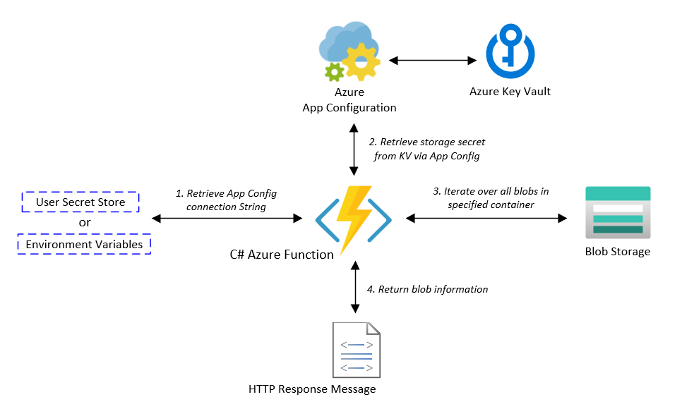

# Key Vault Demos - Azure Functions

## Code in this repo demonstrates accessing Azure Key Vault from an Azure Function 

<properties
    pageTitle="Key Vault Azure Function Demo"
    description="Sample application demonstrating usage of Azure Key Vault from an Azure Function"
    services="key-vault,app-configuration,blob-storage"
    documentationCenter="Azure"
/>

<tags
    ms.service="key-vault"
    ms.devlang="C#"/>

Assemblies utilized:
- Microsoft.Extensions.Configuration.UserSecrets;
- Microsoft.Extensions.Configuration.AzureAppConfiguration;
- Azure.Storage.Blobs;
- Azure.Identity;

The application provides examples for utilizing the Azure App Configuration service to provide access to secrets stored in Azure Key Vault for an Azure Function. AzureAppConfiguration can be injected into an Azure Function by implementing a custom ConfigurationBuilder within an Azure Function class.

AzureAppConfiguration requires a connection string to the indicated Azure App Configuration instance. This could be provided via:
- Local User Secret
- Environment Variable
- Local Config File

Once ConfigurationBuilder is implemented in the functions constructor, the local configuration object can be used as an array to reference configuration settings by name (sample provided).

This sample function retrieves the connection string to a specified blob storage account in the function's Run method. It then uses this to instantiate an Azure.Storage.Blobs.BlobServiceClient, and the blobs within the container are iterated. A count of the number of blobs within the container is returned within the function's response message.
